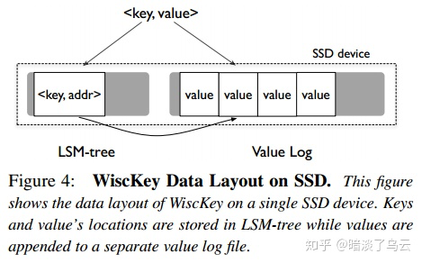

# Project1 Standalone KV

这一节实验要求我们基于 badger 实现一个支持 Column Family 的 KV 数据库。

> Column Family，也叫 CF，这个概念从 HBase 中来，就是将多个列合并为一个CF进行管理。这样读取一行数据时，你可以按照 CF 加载列，不需要加载所有列（通常同一个CF的列会保存在同一个文件中，所以这样有很高的效率）。此外因为同一列的数据格式相同，你可以针对某种格式采用高效的压缩算法。


当然这里的 CF 就没有那么高级，纯粹是让一个 KV 数据库支持多列而已。不然 KV 数据库按照概念就是一个 key 对应一个 value 。如果我想让 KV 数据库和传统数据库一样有多列怎么办呢？如下图：

|KEY|default|write|lock|
|---|---|---|---|
|smith|123|xxxx|yyyy|


你可以通过在 key 前面加前缀的方式，实现一个 key 有多列。像上面的你可以看做：

|KEY|VALUE|
|---|---|
|default_smith|123|
|write_smith|xxxx|
|lock_smith|yyyy|


#### Implement standalone storage engine

实现代码：`kv/storage/standalone_storage/standalone_storage.go`

关于 badger 的 API 不要从官网上看最新版，新版的 API 已经变动了。按照 [https://github.com/Connor1996/badger](https://github.com/Connor1996/badger) 里面的文档进行操作就行。

badger 不提供 CF 的支持，所以你要通过`kv/util/engine_util` 提供的方法来添加前缀。

```Go
err := txn.Set(engine_util.KeyWithCF(v.Cf(), v.Key()), v.Value())
```


在 `NewStandAloneStorage(conf *config.Config)` 方法中，我们会创建 badger，badger 的创建参数从 conf 里面拿就行了。

`Write()` 方法注意传入的是 `batch []storage.Modify` 是一个批量操作，我们需要逐个遍历每一个元素，写入 badger 中的同一个 txn。

Reader 方法需要我们返回一个 `storage.StorageReader` ，这里自己写一个 Reader 实现`StorageReader` 接口就行了。Reader 里面包含一个 `txn`  成员变量。

从txn中读取或者遍历的方法不用自己写，使用 `engine_util` 提供的方法即可。

```Go
// get value
val, err := engine_util.GetCFFromTxn(txn, cf, key)
// get iterator
iter := engine_util.NewCFIterator(cf, txn)
```


#### Implement service handlers

实现代码：`kv/server/raw_api.go`，可以参考`kv/server/server.go` 但是远没有它这么复杂。

这里我们基于刚刚自己编写的 `StandAloneStorage` 来实现上层服务，提供 RawGet/ RawScan/ RawPut/ RawDelete四种请求。

这里我们会涉及到 `storage.Modify` 具体可以看 `kv/storage/modify.go`。

比如一个 Put 请求，我们可以这么写：

```Go
put := storage.Put{
  Key:   req.GetKey(),
  Value: req.GetValue(),
  Cf:    req.GetCf(),
}
modify := storage.Modify{Data: put}
```


- RawGet： 如果获取不到，返回时要标记 `reply.NotFound=true`。
- RawPut：把单一的 put 请求用 `storage.Modify` 包装成一个数组，一次性写入。
- RawDelete：和 RawPut 同理。
- RawScan：通过 reader 获取 iter，从 StartKey 开始，同时注意 limit。迭代的写法可以如下：

```Go
for iter.Seek(startKey); iter.Valid(); iter.Next() {
  if nums >= req.GetLimit() {
    break
  }
  item := iter.Item()
  // ......
  nums++
}
iter.Close()
```


#### Badger

Badger 采用的也是 LSM-tree 结构，但是它参考了 [WiscKey](https://www.usenix.org/system/files/conference/fast16/fast16-papers-lu.pdf) 的设计，这里简单说下。

LSM有两个缺点，一个是读取放大，一个是写入放大。WiscKey 假设我们都是有钱人，用的是SSD，那么我们就没有必要像传统LSM一样耗费大量的性能去实现顺序读。WiscKey 采取如下设计：



将 key 和指向 value 的 addr 仍然放在 LSM-tree 里面，value 则单独放在 Value log 中。因为 key 和 addr 通常都很小，所以这一部分数据完全可以加载在内存中。也就是 LSM 中的 MemTable 可以容纳大量的 key，以至于你的读取某一个 key 时都不需要访问磁盘，直接可以从内存中获取该 key 所在的位置。

Value log 中的数据都是直接 append 的，不需要和 LSM 一样需要实现排序，这样就不存在写入放大的问题。

代价是什么？当你需要 scan 某一个范围的数据时，你会涉及大量的随机读取，因为 Value log 中的  value 是无序的。不过有些 SSD 的随机读性能可以基本持平顺序读，所以问题不大。

#### 总结

这一节实验非常简单，估计是 TinyKV 为了不打击我们的自信心，给的一个热身项目，让我们熟悉一下 go 的语法。

