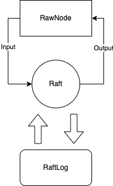
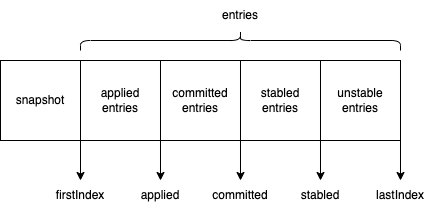
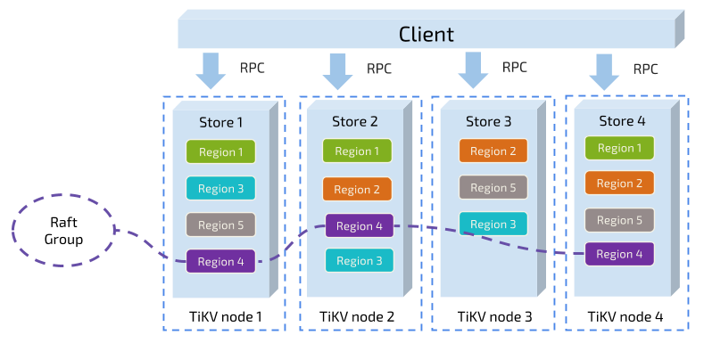

# Project2 RaftKV

这一节需要我们实现 Raft，TinyKV Raft 这部分很多都是抄 Etcd 的 Raft 模块。你可以注意到连测试用例都很像。所以这一节我拿到手就会做啊，首先去 Etcd clone 一份源码。我抄的是 Etcd 3.5.1 版本，也就是目前最新版。

TinyKV 中的 Raft 和 6.824 中的 Raft 有很大的不同。这里将整个 Raft 设计为一个状态机，从一端输入消息，从另一端输出消息，整一个过程是线性的，你**不需要考虑并发**的情况，这能极大降低心智负担。

在这一节实验中，大家一定可以参考 [https://www.codedump.info/post/20180922-etcd-raft/](https://www.codedump.info/post/20180922-etcd-raft/)  这个网站，会有很大的帮助。

这里我将 Project2 中 3 个实验合在一起讲，同时有些内容是在 Project3 中才会遇到，如果在这里你不懂，可以先直接跳过。

在 Part A 实验中，我们需要实现三个模块。分别是 RawNode，Raft 和 RaftLog。三个模块分别对应 `rawnode.go`，`raft.go `和 `log.go` 三个文件。三个模块的结构图如下所示： 



RawNode 负责向 Raft 中输入数据，Raft 得到输入数据后，进行处理，同时将一些临时信息存储在 RaftLog 之中。注意，这里的 RaftLog 只是一个内存型 log，这里面的东西并不会持久化。等 Raft 处理完成后，RawNode 会从 Raft 中取出结果。

> 一开始我没有理解这种架构，这里我打个比方。Raft 相当于 CPU，RaftLog 相当于 CPU 的缓存，用于临时存储信息，RawNode 相当于主板。Raft 只负责处理数据，当它需要持久化某些内容或发送 msg 给其他节点时，会交由 RawNode 处理。RawNode 相当于一个主板，msg 请求它会转发给网卡进行发送，需要持久化的内容则转发到存储器进行存储。而 RaftLog 就是 Raft 的一个临时缓存，保存 Raft 当前的状态，比如当前 index，term 等等。

输入的数据包含来自其他节点发过来的 msg ，也可能是上层 client 发起的请求，比如上层 propose 数据等。

## RaftLog

首先从底层的 RaftLog 说起，RaftLog 用于存储 Raft 的临时信息，结构体如下：

```Go
// RaftLog manage the log entries, its struct look like:
//
//  snapshot/first.....applied....committed....stabled.....last
//  --------|------------------------------------------------|
//                            log entries
//
// for simplify the RaftLog implement should manage all log entries
// that not truncated
type RaftLog struct {
  // storage contains all stable entries since the last snapshot.
  storage Storage

  // committed is the highest log position that is known to be in
  // stable storage on a quorum of nodes.
  committed uint64

  // applied is the highest log position that the application has
  // been instructed to apply to its state machine.
  // Invariant: applied <= committed
  applied uint64

  // log entries with index <= stabled are persisted to storage.
  // It is used to record the logs that are not persisted by storage yet.
  // Everytime handling `Ready`, the unstabled logs will be included.
  stabled uint64

  // all entries that have not yet compact.
  entries []pb.Entry

  // the incoming unstable snapshot, if any.
  // (Used in 2C)
  pendingSnapshot *pb.Snapshot

  // Your Data Here (2A).
  // all index > dummyIndex
  dummyIndex uint64
}
```



首先说明一点，这里的 `entries` 是包含**所有未被 compact 的 entry**。也就是 snapshot 之后所有的数据都在 entries 里面，其包含了**持久化和未持久化的数据**。所以当你新建一个 RaftLog 的时候，你需要先从上层 storage 获取所有的未被持久化的 entries。按下面这么写就行了。

```Go
  firstIndex, err := storage.FirstIndex()
  if err != nil {
    panic(err)
  }
  
  lastIndex, err := storage.LastIndex()
  if err != nil {
    panic(err)
  }

  entries, err := storage.Entries(firstIndex, lastIndex+1)
  if err != nil {
    panic(err)
  }
```

> 也许你会问，按道理 stabled 之前的数据已经被持久化了，没必要再载入内存。这么做当然是为了实现简单，用内存换效率。你完全可以 entries 只存储未被持久化的数据，但是过会你就后悔了。像 Etcd 中它会直通过 stable 和 unstable 结构来进行区分，这里为了简单，就混一起了。

这里我使用了一个 `dummyIndex` ，这招是从链表里面学来了，然后 `firstIndex = dummyIndex + 1` 。之所以这么做是为了和上层保持一致，上层的 storage 也会存储着 dummyEntry，为 firstIndex 前一位的 entry。

当我们更新 RaftLog 的 stabled 或 committed 这类值时，我不推荐直接通过 `log.applied=xxx` 这种方式进行修改。这里推荐采取和 Etcd 一样的方法，创建一个 `appliedTo()` 方法，这样可以在里面可以加入一些逻辑判断，及时定位 BUG。

```Go
func (l *RaftLog) appliedTo(i uint64) {
  if i == 0 {
    return
  }
  if l.committed < i || i < l.applied {
    log.Panicf("applied(%d) is out of range [prevApplied(%d), committed(%d)]", i, l.applied, l.committed)
  }
  l.applied = i
}
```

注意当 Snapshot 被应用后，需要清除 `entries` 中已经被 compact 的数据。触发这个方法的时机其实随意，毕竟方法名都叫`maybeCompact()`，你可以在任意时间段检查上层 storage 的 firstIndex 是否有变化，如果 firstIndex 变大了，则代表上层发生了截断，这时你可以移除 RaftLog 中的已经被 snapshot 的 entries。我是在每一次 Advance 的时候执行该函数（偷偷说一句，其实你不 compact 也没事，测试用例测不出来）。

## Raft

在 Raft 模块，我们首先要理解各个 Msg 的作用以及含义。

 Msg 分为两种，分别为 *local message* 和*普通message*。Local message 是本地发起的 message，比如 propose 数据，发起选举等等。你可以通过 `term=0` 来判断 msg 是不是 local message。 其余的 message 都是其他节点通过网络发来的 msg，其必定含有 term 信息。

### Raft 驱动规则

先主要说明两个方法：

- `Step(m pb.Message)` ，上层 RawNode 用于传递消息给 Raft。这里可以先根据 term 进行统一处理，比如收到小于自己 term 的 msg，直接忽略或者返回 reject。然后再根据自己当前的 State，分类进行处理，具体参考 Etcd。
- `Tick()`，同样会被上层的 RawNode 调用，每调用一次增加自己的 `r.heartbeatElapsed` 和 `r.electionElapsed`，然后根据 State 进行相应的处理，比如是 Leader 的话就发送心跳。

这里说下整个规则，上层的 RawNode 会定时调用 `tick()`，驱动 Raft，同时如果有消息，则通过 `Step()` 函数传递给 Raft。然后 Raft 进行一系列的处理。将需要发送给其他节点的消息存放在 `r.msgs` 中，RawNode 会在生成 Ready 的时候取走并发送给别的节点。

整一个流程是线性的，`Tick()` 和`Step()` 不会被同时触发，这里不存在多线程的情况。

### MessageType

Raft 通过一个 Message 结构体包含了所有种类的 message，所以其字段对于某一种 msg 肯定是有富余的，下面会列出所有的 Message 含义，有些是在 Project3 中被使用。

#### MessageType_MsgHup

Local Message，收到后自己直接开始发起选举，但是要先判断自身的条件是否满足选举条件。

- 判断自己是否在当前的 Prs 里面。因为自己可能已经被移除（Project3 涉及）。
- 判断是否有 pendingSnapshot。如果正在 applying snapshot，则不要发起选举，因为一定是其他的 leader 发给你 snapshot，如果你发起选举，你的 term+1 必定大于现有的 leader，这会造成集群的不稳定。（当然也有可能出现一致性问题，不过我没想通）。

|所需字段|作用|
|---|---|
|MsgType|标注类别|

#### MessageType_MsgBeat

Local Message，收到后，如果自己是 Leader，则广播 heartbeat。

|所需字段|作用|
|---|---|
|MsgType|标注类别|

#### MessageType_MsgPropose

Local Message，propose 数据。注意只有 Leader 才能处理 propose 数据，如果不是 leader，直接返回 `ErrProposalDropped` （可以不直接返回 `ErrProposalDropped`，而是把 msg 转发给你已知的 Leader，具体后面会说）。

如果当前你的 `leadTransferee` 不为空，则说明该节点正在转移 Leader，不能 propose 数据，应该直接返回 `ErrProposalDropped` （Project3 涉及）。

|所需字段|作用|
|---|---|
|MsgType|标注类别|
|Entries|Propose 的数据|
|To|转发到别的 Leader 时需要|

#### MessageType_MsgAppend

用于 Leader 向其他节点同步数据。

|所需字段|作用|
|---|---|
|MsgType|标注类别|
|Index|论文中的 prevLogIndex|
|Term|Leader 的 term|
|LogTerm|论文中的 prevLogTerm|
|Entries|Append 的数据|
|Commit|Leader 的 committed|
|To|目标节点|

发送 Append 的时候，如果 Leader 发现对方节点所需的 index 已经被 compact 了，那么 Leader 应该转而发送 `MessageType_MsgSnapshot`。

#### MessageType_MsgSnapshot

当 Leader 发现目标节点所需的日志已经被 compact 的时候，则发送 Snapshot。

|所需字段|作用|
|---|---|
|MsgType|标注类别|
|Term|Leader 的 term|
|Snapshot|Snapshot 数据，通过`r.RaftLog.storage.Snapshot()` 获取|
|To|目标节点|

#### MessageType_MsgAppendResponse

用于回复收到的 `MessageType_MsgAppend` 和 `MessageType_MsgSnapshot`。

|所需字段|作用|
|---|---|
|MsgType|标注类别|
|Index|下面细说|
|Term|节点当前 term|
|Reject|如果为 true，则代表日志不匹配，无法添加。告诉 Leader 向前匹配日志|
|To|目标节点|

Index 在不同情况下意义不同，我是如下这么处理的：

- 如果是回复 `MessageType_MsgSnapshot`，那么 index 则是目标节点安装 snapshot 后的 committed。
- 如果是回复 `MessageType_MsgAppend`且无 reject，那么回复的是最新匹配的 index。
- 如果是回复 `MessageType_MsgAppend`且有 reject，那么可以选择回复 hintIndex 辅助 Leader 快速回退定位日志，也可以 index 字段为空。因为 Leader 那里仍然可以通过 nextIndex 进行回滚。

Follower 接收消息时，如果 prevLogIndex 已经是被 compact 了，那么也返回 append 成功，但是返回的 index 应该是你的 committed。（我有一个 BUG 就是这么引起的，极难复现，会产生 request timeout 问题）。

Leader 端处理很简单，如果 reject 为 true，那么开始回滚匹配。如果为 false，那么更新该节点的 matchIndex 和 nextIndex，同时尝试推进 committed。

这里有一种特殊情况，如果 Leader 收到了 `MessageType_MsgAppendResponse` 为 true，且对方已经拥有和自己一样的最新日志，然后对方节点又正好是要转移 Leader 的目标节点，那么说明和目标同步完成，可以移交 Leader 给对方。给对方发送 `MessageType_MsgTimeoutNow`。（Project3 涉及）

```Go
if m.From == r.leadTransferee && pr.Match == r.RaftLog.LastIndex() {
  r.sendTimeoutNow(m.From)
}
```

#### MessageType_MsgRequestVote

Candidate 用于发送投票请求。

|所需字段|作用|
|---|---|
|MsgType|标注类别|
|Term|节点当前 term|
|Index|论文中的 lastLogIndex|
|LogTerm|论文中的 lastLogTerm|
|To|目标节点|

Candidate 一轮投票失败后，不需要自增 term，而是复用原来的 term 进行投票。这样可以避免集群的选举竞争。

#### MessageType_MsgRequestVoteResponse

回复 `MessageType_MsgRequestVote` 。如果当前 Term 还没有给其他节点投过票，那么可以投票给它，且将自己的 `r.Vote = m.From` ，同时 `r.electionElapsed=0` 。

|所需字段|作用|
|---|---|
|MsgType|标注类别|
|Term|节点当前 term|
|Reject|不同意给其投票为 true|
|To|目标节点|

#### MessageType_MsgHeartbeat

Leader 发送的 Heartbeat。

|所需字段|作用|
|---|---|
|MsgType|标注类别|
|Term|Leader 的 term|
|Commit|`min(matchIndex, r.RaftLog.committed)`|
|To|目标节点|

Follower 收到后根据 Commit 推进自己的 committed。

#### MessageType_MsgHeartbeatResponse

|所需字段|作用|
|---|---|
|MsgType|标注类别|
|Term|节点当前 term|
|To|目标节点|

回复下 Leader 的 MsgHeartbeat，如果 Leader 收到后发现其 `matchIndex < r.RaftLog.LastIndex()` 则触发 append 流程。因为存在一种情况，目标节点网络不通畅，当其和 Leader 恢复通讯后，日志是可能落后的。当网络恢复正常，Leader 收到 `MessageType_MsgHeartbeatResponse` 知道其落后，应立即触发 Append 进行同步。

#### MessageType_MsgTransferLeader

Local message，发起 Leader Transfer。（Project3 使用）

|所需字段|作用|
|---|---|
|MsgType|标注类别|
|From|Transfer 的目标节点|

Leader 收到该请求后，设置 `r.leadTransferee = m.From`，同时检查目标节点是否已经包含了自己所有的日志，如果不包含，则启动 Append 流程进行同步，同步的过程中不再接收任何新的 propose 请求。如同步完成后，发送 `pb.MessageType_MsgTimeoutNow` 到目标节点。

#### MessageType_MsgTimeoutNow

目标节点收到该消息，即刻自增 term 发起选举，注意重置 elapsed。（Project3 使用）

|所需字段|作用|
|---|---|
|MsgType|标注类别|
|Term|节点当前 term|
|To|Transfer 的目标节点|

### Local Message 转发优化

Local message，只有 Leader 才能够处理，如果非 Leader 节点收到此消息，可以修改 msg 的 To 将该消息转发到其已知的 Leader 上。

```Go
if r.Lead == None {
  return nil;
}
m.To = r.Lead
r.send(m)
```

## RawNode

RawNode 既负责从 Raft 中取出数据，也负责向 Raft 中赛数据。

RawNode 通过生成 Ready 的方式给上层传递信息。这里主要说一下 SoftState 和 HardState。SoftState 不需要被持久化，存粹用在`HasReady()` 方法中的判断，其判断是否有产生新的 Ready。而 HardState 需要上层进行持久化存储。

`Advance(rd Ready)` 是上层处理完了 Ready，通知用于通知 RawNode，以推进整个状态机。

## 中场小结

至此应该可以完成 Project2B 之前的实验。

这里简单梳理一下 RaftLog，Raft 和 RawNode 的处理流程。

- 上层会出发 RawNode 的 `tick()` 函数发，RawNode 触发 Raft 的 `tick()` 函数。
- 上层会定时从 `RawNode` 获取 Ready，首先上层通过 `HasReady()` 进行判断，如果有新的 Ready，上层会调用 RawNode 的 `Ready()`方法进行获取，RawNode 从 Raft 中 获取信息生成相应的 Ready 返回给上层应用，Raft 的信息则是存储在 RaftLog 之中。上层应用处理完 Ready 后，会调用 RawNode 的 `Advance()` 方法进行推进，告诉 RawNode 之前的 Ready 已经被处理完成，然后你可以执行一些操作，比如修改 applied，stabled 等信息。
- 上层应用可以直接调用 RawNode 提供的 `Propose(data []byte)` ，`Step(m pb.Message)` 等方法，RawNode 会将这些请求统一包装成 Message，通过 Raft 提供的 `Step(m pb.Message)` 输入信息。

---

接下来这部分会说明 RawNode 上面一层的东西。开始之前先说明 TinyKV 中三个重要的概念，图是 TiKV 扒来的。里面每一个彩色的小方格代表一个 peer。



- Store：每一个节点叫做一个 store，也就是一个节点上面只有一个 Store。代码里面叫 RaftStore，后面统一使用 RaftStore 代称。
- Peer：一个 RaftStore 里面会包含多个 peer，一个 RaftStore 里面的所有 peer 公用同一个底层存储，也就是多个 peer 公用同一个 badger 实例。
- Region：一个 Region 叫做一个 Raft group，一个 region 包含多个 peer，这些 peer 散落在不同的 RaftStore 上。Region 处理的是某一个范围的数据。比如 Region A 处理 $0<key<split$，Region B 处理 $split≤key<MAX$，两个 Region 各司其职，互不干涉，均有自己的 Leader。

> 注意：一个 Region 在一个 RaftStore 上最多只有一个 peer，因为一个 region 里面所有 peer 的数据是一致的，如果在同一个 RaftStore 上面有两个一样的 peer，就毫无意义，并不能增加容灾性。

## RaftStore

RaftStore 会在节点启动的时候被创建，它负责维护在该节点上所有的 region 和对应的 peer。

RaftStore 使用 `storeMeta `维护该节点所有的元数据。

```Go
type storeMeta struct {
  sync.RWMutex
  /// region end key -> region ID
  regionRanges *btree.BTree
  /// region_id -> region
  regions map[uint64]*metapb.Region
  /// `MsgRequestVote` messages from newly split Regions shouldn't be dropped if there is no
  /// such Region in this store now. So the messages are recorded temporarily and will be handled later.
  pendingVotes []*rspb.RaftMessage
}
```

- `sync.RWMutex` ，因为一个 RaftStore 上面的多个 region 可以同时接收请求，所以为了防止它们同时修改 storeMeta 元数据，这里会提供一个锁。
- `regionRanges`，用于快速定位某一个 key 在哪个 region 中。
- `regions`，region id 映射 region 结构体。
- `pendingVotes`，自己不用管，已经写好了。

RaftStore 被启动后，其首先会加载 peers，然后将 peers 注册进 router。加载 peer 的时候如果底层存储着之前 peer 信息，那么根据存储的信息加载，否则就新建。之后会启动一系列的 worker。RaftStore 的主要工作你可以认为就是接收来自其他节点的 msg，然后根据 msg 里面的 region id 将其路由到指定 region 的 peer 上。同时 RaftStore 也会将 peer 获取需要发送给其他节点的信息，发到其他的 RaftStore 上。

重点可以看 `raft_worker.go` 文件中的`run()`方法，

```Go
func (rw *raftWorker) run(closeCh <-chan struct{}, wg *sync.WaitGroup) {
  defer wg.Done()
  var msgs []message.Msg
  for {
    msgs = msgs[:0]
    select {
    case <-closeCh:
      return
    case msg := <-rw.raftCh:
      msgs = append(msgs, msg)
    }
    pending := len(rw.raftCh)
    for i := 0; i < pending; i++ {
      msgs = append(msgs, <-rw.raftCh)
    }
    peerStateMap := make(map[uint64]*peerState)
    for _, msg := range msgs {
      peerState := rw.getPeerState(peerStateMap, msg.RegionID)
      if peerState == nil {
        continue
      }
      newPeerMsgHandler(peerState.peer, rw.ctx).HandleMsg(msg)
    }
    for _, peerState := range peerStateMap {
      newPeerMsgHandler(peerState.peer, rw.ctx).HandleRaftReady()
    }
  }
}
```

主要注意就是 `newPeerMsgHandler(peerState.peer, rw.ctx).HandleMsg(msg)` 和 `newPeerMsgHandler(peerState.peer, rw.ctx).HandleRaftReady()` ，可以看到先通过 `HandleMsg()`，RaftStore 将收到的信息告诉该 peer，然后该 peer 进行一些列的处理，RaftStore 再通过 `HandleRaftReady()` 处理 RawNode 产生的 Ready。

这里可以看到 `PeerMsgHandler` 每一次都是被 new 出来的，也就是用完即扔。

## PeerMsgHandler

PeerMsgHandler 主要就看如下两个方法。

### HandleMsg()

`HandleMsg(msg message.Msg)` 负责分类处理各种 msg。

- MsgTypeRaftMessage，来自外部接收的 msg，在接收 msg 前会进行一系列的检查，最后通过 RawNode 的 `Step() `方法直接输入，不需要回复 proposal。
- MsgTypeRaftCmd，通常都是从 client 或自身发起的请求，比如 Admin 管理命令，read/write 等请求，需要回复 proposal。
- MsgTypeTick，驱动 RawNode 的 tick 用。
- MsgTypeSplitRegion，触发 region split，在 project 3B split 中会用到。
- MsgTypeRegionApproximateSize，修改自己的 ApproximateSize 属性，不用管。
- MsgTypeGcSnap，清理已经安装完的 snapshot。
- MsgTypeStart，启动 peer，新建的 peer 的时候需要发送这个请求启动 peer，在 Project3B split 中会遇到。

### HandleRaftReady()

1. 通过 `d.RaftGroup.HasReady()` 方法判断是否有新的 Ready，没有的话就什么都不用处理。
2. 如果有 Ready 先调用 `d.peerStorage.SaveReadyState(&ready)` 将 Ready 中需要持久化的内容保存到 badger。如果 Ready 中存在 snapshot，则应用它，后面会细说。
3. 然后调用 `d.Send(d.ctx.trans, ready.Messages)` 方法将 Ready 中的 Messages 发送出去。
4. Apply `ready.CommittedEntries` 中的 entry。
5. 调用 `d.RaftGroup.Advance(ready)` 方法推进 RawNode。

整个代码结构如下（省略版）：

```Go
func (d *peerMsgHandler) HandleRaftReady() {
  if d.stopped {
    return
  }

  if d.RaftGroup.HasReady() {
    ready := d.RaftGroup.Ready()
    // ....
    d.peerStorage.SaveReadyState(&ready)
    // ...
    d.Send(d.ctx.trans, ready.Messages)

    // ...
    if len(ready.CommittedEntries) > 0 {
      applyEntries(.....)
    }

    d.RaftGroup.Advance(ready)
  }
}
```

> 这里提一句，我们可以使用异步 apply 来优化程序的性能，因为数据只要被 commit 了，那么必定已经被持久化了。所以这里通过另起一个线程 apply 也是没问题的，只要我们按照 commit 的顺序 apply 即可。具体的我没试过，能力有限。

## PeerStorage

PeerStorage 负责该 peer 的存储。TinyKV 这里提供了两个 badger 实例，分别是 raftDB 和 kvDB，这里说明下存储的内容。

raftDB 存储：

- Ready 中需要 stable 的 entries。
- RaftLocalState

kvDB 存储：

- RaftApplyState
- RegionLocalState

写入可以通过 WriteBatch 进行优化，最后调用 WriteBatch 的 `MustWriteToDB()` 方法优雅的写入。

### SaveReadyState()

这个方法主要是负责持久化 Ready 中的数据。

1. 判断是否有 Snapshot，如果有 Snapshot，先调用 `ApplySnapshot()` 方法应用。可以通过 `raft.isEmptySnap()` 方法判断是否存在 Snapshot。
2. 调用 `Append()` 方法将需要持久化的 entries 保存到 raftDB。
3. 保存 ready 中的 HardState 到 `ps.raftState.HardState`，注意先使用 `raft.isEmptyHardState()` 进行判空。
4. 持久化 RaftLocalState 到 raftDB。
5. 最后通过 `MustWriteToDB()` 方法写入。

### ApplySnapshot()

1. 负责应用 Snapshot，先通过 `ps.clearMeta` 和 `ps.clearExtraData()` 清除原来的数据，因为新的 snapshot 会包含新的 meta 信息，需要先清除老的。
2. 根据 Snapshot 的 Metadata 信息更新当前的 raftState 和 applyState。并保存信息到 WriteBatch 中，可以等到 `SaveReadyState()` 方法结束时统一写入 DB。
3. 发送 `RegionTaskApply` 到 `regionSched` 安装 snapshot，因为 Snapshot 很大，所以这里通过异步的方式安装。我这里是等待 Snapshot 安装完成后才继续执行，相当于没异步，以防出错。

```Go
ch := make(chan bool, 1)
ps.regionSched <- &runner.RegionTaskApply{
  RegionId: ps.region.GetId(),
  Notifier: ch,
  SnapMeta: snapshot.Metadata,
  StartKey: snapData.Region.GetStartKey(),
  EndKey:   snapData.Region.GetEndKey(),
}
// wait to snapshot installed
<-ch
```

> 这里有一点一定要住，在调用 `ps.clearMeta` 和 `ps.clearExtraData()` 清除老数据时先判断 `ps.isInitialized()`。因为在 project3B 中，在一个新的 peer 被创建时，其 region 的 startKey，endKey 为空。如果你直接调用 `ps.clearMeta` 和`ps.clearExtraData()`，你会把老的数据直接清空，看了源码你就知道，然后会导致各种莫名其妙不一致的问题（出现概率次数不多，1/15）较难排查。

### Append()

将 Ready 中的 entries 持久化到 raftDB 中，并移除永远不会被 commit 的数据（当然你不移也没事，测不出来）。最后更新 RaftLocalState 的状态。

## Snapshot 流程

Snapshot 的流程比较复杂，那时候看得云里雾里，现在在这里说清整个 Snapshot 的调用链。

先说每一个节点是如何自动的 compact 自己的 entries。

1. 在 `HandleMsg()` 中收到 `message.MsgTypeTick`，然后 `onTick()` 函数触发 `d.onRaftGCLogTick()`，当发现满足 compact 条件时，创建一个 `CompactLogRequest` 通过 `d.proposeRaftCommand()` 提交。
2. 像普通请求一样，将 `CompactLogRequest` 请求 propose 到 Raft 中，等待 Raft Group 确认。
3. Commit 后，在 `HandleRaftReady()` 中开始 apply `CompactLogRequest` 请求。此时你可以修改自己 `RaftApplyState` 中的`RaftTruncatedState` 属性。
4. 调用 `d.ScheduleCompactLog()` 发送 `RaftLogGCTask` 任务。
5. `raftlog_gc.go` 里面收到 `RaftLogGCTask `并在 `gcRaftLog()` 函数中处理。它会清除 raftDB 中已经被持久化的 entries，因为已经被 compact 了，所以不需要了。
6. 至此所有节点已经完成了日志的截断，以此确保 raftDB 中的 entries 不会无限制的占用空间（毕竟已经被 apply 了，留着也没多大作用）。

---

接下来是发送环节，当 Leader append 日志给落后 node 节点时，发现对方所需要的 entry 已经被 compact。此时 Leader 会发送 Snapshot 过去。

1. 当 Leader 需要发送 Snapshot 时，调用 `r.RaftLog.storage.Snapshot()` 生成 Snapshot。因为 Snapshot 很大，不会马上生成，这里为了避免阻塞，如果 Snapshot 还没有生成好，Snapshot 会先返回 `raft.ErrSnapshotTemporarilyUnavailable` 错误，Leader 就应该放弃本次 Snapshot，等待下一次再次请求 Snapshot。
2. 生成 Snapshot 请求是异步的，通过发送 `RegionTaskGen` 到 `region_task.go` 中处理，会异步的生成 Snapshot。
3. 下一次 Leader 请求 `Snapshot()` 时，因为已经创建完成，直接拿出来，包装为 `pb.MessageType_MsgSnapshot` 发送至目标节点。
4. 发送 Snapshot 并不是和普通发送消息一样。在 `peer_msg_handler.go` 中通过 `Send()` 发送，这个函数最后会调用 `transport.go` 中的 `Send()`，你根据方法链调用，看到在 `WriteData()` 函数中，Snapshot 是通过 `SendSnapshotSock()` 方法发送。后面它就会将 Snapshot 切成小块，发送到目标 RaftStore 上面去。这里不细说，太复杂了。
5. 目标 RaftStore 在 `server.go` 中的 `Snapshot()` 接收发送过来的 Snapshot。之后生成一个 `recvSnapTask` 请求到 `snapWorker`中。`snap_runner.go` 中收到 `recvSnapTask` 请求，开始下载发送过来的 Snapshot 并保存在本地（此时还没应用），同时生成 `pb.MessageType_MsgSnapshot` 发送到要接收的 peer 上。
6. 目标 peer 会在 `OnRaftMsg()` 中像处理普通 msg 一样，将 `pb.MessageType_MsgSnapshot` 通过 `Step()` 输入 RawNode。
7. Raft 中则根据 Snapshot 中的 metadata 更新当前自己的各种状态并设置 `pendingSnapshot`，然后返回一个 `MessageType_MsgAppendResponse` 给 Leader。
8. 接收节点在 `HandleRaftReady()`→`SaveReadyState()`→`ApplySnapshot()` 中根据 `pendingSnapshot` 的 Metadata 更新自己的 `RaftTruncatedState` 和 `RaftLocalState`，然后发送一个 `RegionTaskApply` 请求到 `region_task.go` 中。此时它会异步的把刚刚收到保存的 Snapshot 应用到 kvDB 中。
9. 最后在 `Advance()` 的时候，清除 `pendingSnapshot`。至此，整个 Snapshot 接收流程结束。

可以看到 Snapshot 的 msg 发送不像传统的 msg，因为 Snapshot 通常很大，如果和普通方法一样发送，会占用大量的内网宽带。同时如果你不切片发送，中间一旦一部分失败了，就全功尽气。这个迅雷的切片下载一个道理。

## 注意事项

### Proposal 回复处理

Proposal 的回复处理至关重要，处理不好你会出现很多的  `Request timeout`。

这里我采取如下处理逻辑，不放过任何一种情况，大家可以参考下：

```Go
for len(d.proposals) > 0 {
  proposal := d.proposals[0]
  if entry.Term < proposal.term {
    return
  }

  if entry.Term > proposal.term {
    proposal.cb.Done(ErrRespStaleCommand(proposal.term))
    d.proposals = d.proposals[1:]
    continue
  }

  if entry.Term == proposal.term && entry.Index < proposal.index {
    return
  }

  if entry.Term == proposal.term && entry.Index > proposal.index {
    proposal.cb.Done(ErrRespStaleCommand(proposal.term))
    d.proposals = d.proposals[1:]
    continue
  }

  if entry.Index == proposal.index && entry.Term == proposal.term {
    if response.Header == nil {
      response.Header = &raft_cmdpb.RaftResponseHeader{}
    }
    proposal.cb.Txn = txn
    proposal.cb.Done(response)
    d.proposals = d.proposals[1:]
    return
  }
  
  panic("This should not happen.")
}
```

### 持久化

数据应该先被持久化后才能够回复 proposal，这很好理解，不多说。

在 `ApplySnapshot()` 方法中，你保存新的 applyState 和 raftState 时，应该是用 `snapData.Region.Id` 进行保存，而不是用原来的 region Id。

## Raft 优化

### PreVote

在一个 Candidate 被网络隔离的情况下，它会不断自增 term，当网络恢复正常，其会触发整个集群重新选举，造成不必要的波动，这里可以通过 PreVote 机制预防。

在 PreVote 算法中，Candidate 首先要确认自己能赢得集群中大多数节点的投票，这样才会把自己的 term 增加，然后发起真正的投票。其他投票节点同意发给它投票的条件是（同时满足下面两个条件）：

没有收到有效领导的心跳，至少有一次选举超时。
Candidate 的日志足够新（Term 更大，或者 Term 相同 Raft index 更大）。

不过在这里你不能这么实现，因为你过不了 Project 2A 的测试点。

### ReadIndex

Linearizable Read 通俗来讲，就是读请求需要读到最新的已经 commit 的数据，不会读到老数据。

ReadIndex 的实现是当 Leader 接收到读请求时，将当前 commit index 记录下来，记作 read index，在返回结果给客户端之前，Leader 需要先确定自己到底还是不是真的 Leader，确定的方法就是给其他所有 peers 发送一次心跳，如果收到了多数派的响应，说明至少这个读请求到达这个节点时，这个节点仍然是 Leader，这时只需要等到 commit index 被 apply 到状态机后，即可返回结果。

也许你后面不是 Leader，但是这不要紧，只要保证你读请求到达的那一刻，你拥有最新的 commit 数据就行。

如果是 Follower 节点收到读请求，做如下操作：

- Follower 接收到只读指令后，向 Leader 索要当前的 read index 值。
- Follower 端等待自身的状态机的 applyIndex 移动过 read index。
- Follower 端通过查询自身的状态机来执行读操作并返回客户端最终结果。

参考：

[https://www.cnblogs.com/foxmailed/p/7161878.html](https://www.cnblogs.com/foxmailed/p/7161878.html)

[https://zhuanlan.zhihu.com/p/36592467](https://zhuanlan.zhihu.com/p/36592467)

### LeashRead

ReadIndex 到底还是需要一定的 RPC 请求，如果我们使用 LeashRead 则可以避免 Leader 通过发送心跳来确认自己还是 Leader。但是 Raft 的论文中告诫读者不到万不得已不要使用。  

在 ReadIndex 中发送心跳只是为了确认网络没有被分区，当前节点有无被孤立，是否有新的 Leader 产生。而新 Leader 的产生肯定是需要经历一次完整的选举过程，这个选举过程需要一定的时间才能完成。所以一个节点的当前状态是可以被缓存一小段时间的。也就是在这段时间内不可能出现 Leader 的变更。 

Leader 收到 majority 的心跳响应后，在接下来的一小段时间里不必再通过广播心跳来确认分区情况，可以直接和 ReadIndex 一样记录当前的 commit index，然后等待状态机应用它后就可以直接返回用户查询结果。  

之所以作者不推荐该方案是考虑到 clock drift。比如一个定时任务在系统非常繁忙的时候是不一定能得到准时执行的，会产生偏差，偏差的时间取决于系统的繁忙程度、Full GC 是否正在进行、虚拟机是否正在迁移等特殊情况。

## Project2 总结

这一节实验难度适中，一个 Project2 直接把整个 6.824 前 3 个 project 包含了，可见工作量之大，如果没有个 Etcd 提供参考，还真够呛。
