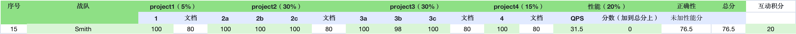

# Talent Plan TinyKV 白皮书

> "If I had known about this repository earlier, perhaps I would have had enough time to work out the Grand Unified Theory."
>
> #### Albert Einstein

原文链接：[https://www.inlighting.org/archives/talent-plan-tinykv-white-paper/](https://www.inlighting.org/archives/talent-plan-tinykv-white-paper/)

## 前言

最近参加了 PingCAP 的 [2021 Talent Plan KV 学习营](https://asktug.com/t/topic/242996)，大概就是在不到两个月的时间里完成 [TinyKV](https://github.com/tidb-incubator/tinykv)。之前做完了 MIT 6.824 就被人安利过，不过那时候看了一眼 README 就被劝退了，太复杂了。好在项目最后是完成了，就是拿了个低分，挺抑郁的。



* 正确性：4 个项目的正确性接近了 100%，意料之中，自己是跑了 150 次 bug free 才交上去的。
* 文档：4 个项目的文档都是 80 分，感觉是一个保底分，没看过比我还低的。估计是因为文档是以教程的形式写的（那时候就打算贴出来启示后人），不符合比赛要求。
* 性能：0 分，原因未知，满分性能的 QPS 是 701，自己就 31.5，很明显是不正常的。我后面要了两份获奖的代码，一起跑了下测试用例，结果并不比他们的慢，甚至还快。但鉴于官方没有公布 QPS 的测法，我也懒得深究了。个人希望以后还是能开源下 QPS 的程序，避免性能 0 分的悲剧上演。

> 关于性能 0 分的猜想：
> 很可能是因为处理 `raft_cmdpb.RaftCmdRequest` 的时候，我是假设 `requests` 数组里面只有一个 request，虽然测试用例里面就是这样，但是我估计官方测 QPS 的时候很可能是 `requests` 数组里面会包含多个 request，故导致了 QPS 特别低。建议大家还是别和我一样了。

反正文档写也是写了，这里就直接贴出来，有不对的地方直接 PR 即可，传送门：

仓库地址：[https://github.com/Smith-Cruise/TinyKV-White-Paper](https://github.com/Smith-Cruise/TinyKV-White-Paper)

* [Project 1 Standalone KV](https://github.com/Smith-Cruise/TinyKV-White-Paper/blob/main/Project1-Standalone-KV.md)
* [Project 2 Raft KV](https://github.com/Smith-Cruise/TinyKV-White-Paper/blob/main/Project2-RaftKV.md)
* [Project 3 Multi-raft KV](https://github.com/Smith-Cruise/TinyKV-White-Paper/blob/main/Project3-MultiRaftKV.md)
* [Project 4 Transaction](https://github.com/Smith-Cruise/TinyKV-White-Paper/blob/main/Project4-Transaction.md)

## 准备工作

**良好的心态**，在你解决 Project 3 的 BUG 时，要保持淡定，不要冲动砸键盘。

**有钱**，你的电脑至少要 5 核以上处理器，16GB 以上内存，SSD 固态。内存越多越好，每多 16 GB 内存你就可以**多并发**运行一个测试用例。**固态是必须的**，如果你使用机械硬盘，你会卡在 Project 3 中的 split 测试点，测试脚本给的时间很短，通常你都来不及 split。之前我用机械硬盘的服务器跑测试用例，老是报错，后来换成固态就 OK 了。

**一台服务器**，因为很多 BUG 都是随机复现，代码你要跑上百次才知道，我可不舍得自己的 MacBook 跑通宵。我最后交卷时是每个测试点运行 150 次不出现 BUG，就算 OK。（主要是真的跑不动了，看到一个 FAIL 就血压拉满，所以只要我不跑，它就没有 BUG）。

## 难点

PingCAP 官方是希望这个项目能给那些没有分布式经验的同学入门学习，不过我个人觉得，这个项目一点都不像是入门项目，门槛很高。一个人如果从没接触过分布式，Go 也不会，我觉得是很难在规定时间内完成这个项目。我个人推荐没基础的还是先去做 6.824，那个简单点（个人觉得，做完 6.824 的 Project 2 就可以来做 TinyKV 了）。

这里说说 TinyKV 的几个坑：

1. 文档不全面，GitHub 上看起来密密麻麻英文写满，实际上还是忽略了很多东西，大家还是要花费大量的时间去了解整个工程。我个人是做到 Project 3 的时候才开始对整个项目有一定的了解，尤其是 Snapshot 的处理，那调用链复杂的可怕。当然这也是我为什么要写白皮书的原因。
2. 测试用例没有完全覆盖，当你做完了 Project2 的时候，你以为你的 Raft OK 了？其实那是你的错觉。我个人还是希望，一个 Project 的测试用例能把当前 Project 方方面面都测试到，而不是非要等到后面才会发现前面有问题。当然我知道这很难，这非常考验测试用例的编写水平。
3. 存在测试用例测不到的情况，比如即使我的 Raft 从来不执行 `maybeCompact()` 方法，测试也能过。在 Project 4 中，这种现象更加明显，比如它会提供 Latch 让我们对 key 进行上锁，但是你不上锁也没事，测试用例测不出来。虽然 TinyKV 的事务需要和 TinySQL 结合，但是我个人还是希望将来能完善一下，毕竟这个 Latch 挺重要，不然可能很多人对 Percolator 中的大前提**单行原子性**会不理解。此外你也许会注意到 Primary Key 的作用在这里也不清晰，具体这里不展开，白皮书里有说明。

这里我个人给每个 Project 的难度评个级，Project 1 < Project 4 << Project 2 <<<< Project 3。Project 1 和 4 是互相独立的，没有依赖。我推荐大家的做题顺序是 `1->2->4->3` ，最后基本你的所有时间都是拿去解 Project 3 中的 BUG。

整个 TinyKV 我的耗时是 119 小时 42 分钟，这只是纯粹 IDE 时间，还没算网页浏览时间：

* Project 1：2小时。
* Project 2：2星期
* Project 3：3 星期。
* Project 4：5 天。

## 参考资料

这里我不多 BB，直接上我看过的链接。大家自己选看就行了，没必要一集一集看过去。

* [Talent Plan 之 TinyKV 学习营推荐课程](https://learn.pingcap.com/learner/course/390002)
* [Talent Plan 2021 KV 学习营分享课](https://learn.pingcap.com/learner/course/510001)

## 批量脚本

这里附上自己写的 shell 循环执行脚本，有需要的人可以 copy 走。

单线程版：

```shell
#!/bin/bash
for ((i=1;i<=150;i++));
do
	echo "ROUND $i";
	make project2c > ./out/out-$i.txt;
done
```

多线程版：

多线程版我没跑成功过，很容易出现 request timeout 问题，机器太拉胯了。。。

```shell
#!/bin/bash
start_time=$(date +%s)
[ -e /tmp/fd1 ] || mkfifo /tmp/fd1
exec 3<>/tmp/fd1
rm -rf /tmp/fd1
# 同时执行 3 个线程
for ((i = 1; i <= 3; i++)); do
  echo >&3
done

for ((i = 1; i <= 150; i++)); do
  read -u3
  {
    echo "ROUND $i"
    make project2c > ./out/out-$i.txt;
    echo >&3
  } &
done
wait

stop_time=$(date +%s)

echo "TIME:$(expr $stop_time - $start_time)"
exec 3<&-
exec 3>&-
```

比较简陋，凑合着用。

## 总结

个人还是很感谢 PingCAP 花费这么多的精力做 Talent Plan，虽然很可惜，没获奖，好在知识终究还是会进大脑的，就是不知道啥时候忘。

写完 TinyKV 后，本应该是一件骄傲的事情，然而甚是焦虑。马上就要春招了，数据库坑位少，肯定都招精英，自己又是半吊子水平，和群里的大佬比差太多了，怕是进不去。找 Java，八股又不如那些全力备战 Java 的人，反正就是不上不下，完犊子了。
